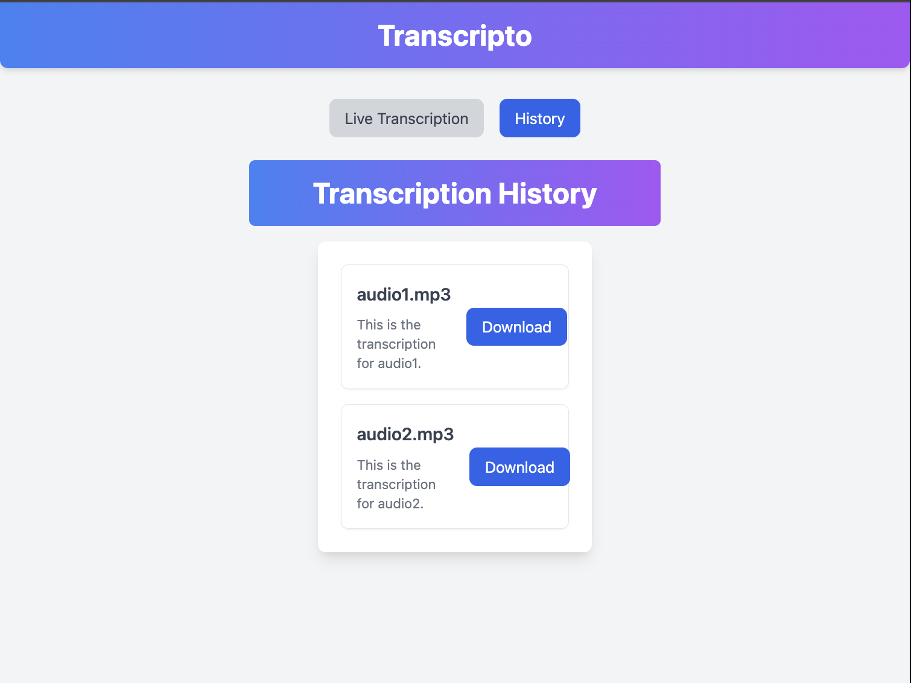

# Transcripto

Transcripto is an AI-powered transcription app that enables users to convert audio files or audio URLs into text using the powerful **AssemblyAI API**. The app is designed with a modern, user-friendly interface and includes features for managing transcription history and downloading results.

---

## Features

- **Real-Time Transcription**: Upload audio files or provide an audio URL for instant transcription.
- **History Management**: View your transcription history and access previous transcriptions easily.
- **Downloadable Transcriptions**: Download transcription results for offline use.
- **Modern UI/UX Design**: Clean, responsive, and accessible interface built with Tailwind CSS.
- **Accessibility-Focused**: Designed to be intuitive and inclusive for all users.

---

## Screenshots

### Main Interface

## Technologies Used

### Frontend
- **React.js** with **TypeScript**
- **Tailwind CSS** for modern, responsive UI design
- **React Router** for routing and navigation

### Backend & API
- **AssemblyAI API** for transcription services
- **File Handling**: Supports audio file uploads and URL-based transcription inputs

---

## Getting Started

### Prerequisites
- **Node.js** installed on your system
- AssemblyAI API key (you can get it from [AssemblyAI](https://www.assemblyai.com))

### Installation

1. Clone the repository:
  bash
   git clone https://github.com/DesignByDevDan/AI-Transcription-App.git
   cd AI-Transcription-App
   

2. Install dependencies:
  bash
   npm install

3. Create a `.env` file in the project root and add your **AssemblyAI API key**:
  env
   REACT_APP_ASSEMBLYAI_API_KEY=your-api-key-here
   

4. Start the development server:
  bash
   npm start
   

5. Open your browser and navigate to:
   
   http://localhost:3000
  
---

## Usage

1. **Upload or Enter URL**: On the home screen, upload an audio file or enter an audio URL.
2. **View Transcription**: Once the transcription is complete, view the result on the page.
3. **Manage History**: Check previous transcriptions in the "History" tab.
4. **Download Results**: Click the download button to save transcriptions as a file.

---

## Folder Structure

src/
├── components/
│   ├── FileUpload/
│   │   └── FileUpload.tsx
│   ├── History/
│   │   └── History.tsx
│   └── ResultDisplay/
│       └── ResultDisplay.tsx
├── App.tsx
├── index.tsx
├── global.css

---

## Future Enhancements

- Add multi-language transcription support
- Integrate with cloud storage for saving transcriptions
- Enhance UI for dark mode compatibility
- Allow sharing transcriptions directly from the app

---

## Contributing

Contributions are welcome! To contribute:

1. Fork the repository
2. Create a new branch (git checkout -b feature-name)
3. Commit your changes (git commit -m "Add some feature")
4. Push to the branch (git push origin feature-name)
5. Open a pull request

---

## License

This project is licensed under the MIT License. See the [LICENSE] file for details.

---

## Acknowledgments

- **AssemblyAI** for providing the API for transcription
- **React.js** and **Tailwind CSS** for making frontend development enjoyable
- The developer community for their ongoing support

---

Enjoy using **Transcripto**!
